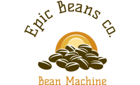

# Innehållsförteckning
 * [Färger](#färger)
 * [Fonter](#fonter)
 * [Stockphoton](#stockfoton)
 * [Logon](#logon)
 * [Extensions](#chrome-extensions)
 * [VS Code extensions](#visual-studio-code-extensions)
 * [Javascript Frameworks](#javascript-frameworks)
 * [React Libraries](#react-libraries)
 * [Code Editors](#code-editors)
 * [Design verktyg](#online-design-verktyg)

 

# Färger
| Websida&nbsp; | &nbsp;&nbsp;&nbsp;&nbsp;&nbsp;&nbsp;&nbsp;&nbsp;&nbsp;&nbsp;&nbsp;&nbsp;&nbsp;&nbsp;&nbsp;&nbsp;Beskrivning |
|---| :---|
| [html Color codes](https://htmlcolorcodes.com/) | Html color picker |
| [html Color picker](https://www.w3schools.com/colors/colors_picker.asp) | w3schools color picker |
| [Color Hunt](https://colorhunt.co/) | Färg paletter för designare |
| [Html Color Chart](https://html-color-codes.info/) | Html color picker |
| [Hex Color Codes](https://www.color-hex.com/) | Hex coder för färger |
| [Color Supply](https://colorsupplyyy.com/) | Bra färg palett sida |
| [Color calculator](https://www.sessions.edu/color-calculator/) | Färg kalkulator
| [Material color tool](https://material.io/resources/color/#!/?view.left=0&view.right=0) | Material designs color tool

 

# Fonter
| Websida&nbsp; | &nbsp;&nbsp;&nbsp;&nbsp;&nbsp;&nbsp;&nbsp;&nbsp;&nbsp;&nbsp;&nbsp;&nbsp;&nbsp;&nbsp;&nbsp;&nbsp;&nbsp;&nbsp;&nbsp;&nbsp;Beskrivning |
|---| :---| 
| [Fontspace](https://www.fontspace.com/) | En websida med 75,000+ gratis fonter|
| [Dafont](https://www.dafont.com/) | En websida med 57,394 gratis fonts |
| [1001 free fonts](https://www.1001freefonts.com/) | En websida med 1001 gratis fonter|
| [Font.com](http://www.fonts.com) | Inte gratis fonter men finns många fonter
| [Adobe Fonts](https://fonts.adobe.com/fonts) | Adobes fonter|
| [Fonts in use](https://fontsinuse.com/)| Se font in use😐 |
| [My Fonts](https://www.myfonts.com/) | Över 130000 fonts|
| [Font Squirrel](https://www.fontsquirrel.com/) | 100% gratis för kommersiell användning |
| [BE fonts](https://befonts.com/) | Gratis fonter för designare |

 

# Stockfoton

| Websida | Beskrivning |
|---|---
| [Shutterstock](https://www.shutterstock.com/photos) | Utforska miljontals professionella stockfoton och royaltyfria bilder
| [Pexels](https://www.pexels.com) | Gratis stockfoton du kan använda överallt
| [Pixabay](https://pixabay.com/) | Över 1,9 miljoner + högkvalitativa stockbilder, videor och musik
| [Unsplash](https://unsplash.com/images/stock) | Bra bilder
| [Stockphoto](https://stockphoto.com/)| Inte gratis och dåligt med bilder
| [istockphoto](https://www.istockphoto.com/) | Istock by Getty Images
| [scandinavian Stockphoto](https://www.scanstockphoto.com/finlandinfo.php) | Gammal websida och dyra bilder
| [rawpixel](https://www.rawpixel.com/?sort=shuffle&page=1&feed=creative-feed) | Det bästa säkert att använda designresurser för alla

 

# Logon

| Websida | Beskrivning |
|---|---|
| [Free Logo Design](https://www.freelogodesign.org/) | Designa din logo gratis
| [Free Logo Service](https://www.freelogoservices.com/) | Gratis logo
| [Logo Maker](https://www.logomaker.com/) | Gratis logo design i minuter
| [Namecheap](https://www.namecheap.com/logo-maker/) | Online logo designer
| [Tailor Brands](https://studio.tailorbrands.com)| Gratis och betalad logon
| [logomaster](https://logomaster.ai/)| Logo maker som kostar mycket
| [logoMakr](https://logomakr.com/)| Designa din egen logo
| [DesignEvo](https://www.designevo.com/)| Gratis online logo

 

# Chrome Extensions
| Websida | Beskrivning |
|---|---|
| [Developer Tool Extension](https://chrome.google.com/webstore/detail/web-developer/bfbameneiokkgbdmiekhjnmfkcnldhhm) | något en webbutvecklare måste ha.|
| [LambdaTest](https://www.lambdatest.com/chrome-extension) | Ta skärmdumpar av dina webbsidor
| [Site Palette](https://chrome.google.com/webstore/detail/site-palette/pekhihjiehdafocefoimckjpbkegknoh)| Gör color paletter
| [Font face Ninja](https://chrome.google.com/webstore/detail/fonts-ninja/eljapbgkmlngdpckoiiibecpemleclhh) | Identifierar fonter på websidor
| [React Developer extension](https://chrome.google.com/webstore/detail/react-developer-tools/fmkadmapgofadopljbjfkapdkoienihi) | Se react komponenthierarkin
| [ColorZilla](https://chrome.google.com/webstore/detail/colorzilla/bhlhnicpbhignbdhedgjhgdocnmhomnp) | färgväljare extension för chrome
| [Page Ruler](https://chrome.google.com/webstore/detail/page-ruler/idhjfgkakeliobkfbijghiaklmiaheag?hl=en)| Mät pixlar på websidor
| [Wappalyzer](https://chrome.google.com/webstore/detail/wappalyzer/gppongmhjkpfnbhagpmjfkannfbllamg) | identifiera web technologier
| [Ghostery](https://chrome.google.com/webstore/detail/ghostery-–-privacy-ad-blo/mlomiejdfkolichcflejclcbmpeaniij) | Anons och tracker blocker

 

# Visual Studio Code Extensions

| Websida | Beskrivning |
|---|---|
| [Debugger For Chrome](https://marketplace.visualstudio.com/items?itemName=msjsdiag.debugger-for-chrome) | En debugger för Chrome
| [LiveServer](https://marketplace.visualstudio.com/items?itemName=ritwickdey.LiveServer) | Live Server
| [Beutify](https://marketplace.visualstudio.com/items?itemName=HookyQR.beautify)| Formaterar din kod
| [Settings Sync](https://marketplace.visualstudio.com/items?itemName=Shan.code-settings-sync) | Spara dina inställningar på github
| [LiveShare](https://marketplace.visualstudio.com/items?itemName=MS-vsliveshare.vsliveshare-pack) | Kollaborera kin kod
| [Better Comments](https://marketplace.visualstudio.com/items?itemName=aaron-bond.better-comments) | Bätttre komentarer
| [Path IntelliSense](https://marketplace.visualstudio.com/items?itemName=christian-kohler.path-intellisense) | Visar stigen till filer
| [Bracket Pair Colorizer](https://marketplace.visualstudio.com/items?itemName=CoenraadS.bracket-pair-colorizer)| Olika färger för brackets som hör ihop

 

# Javascript Frameworks

| Websida | Beskrivning |
|---|---|
| [React Js](https://reactjs.org/) | Framework av Facebook
| [Vue Js](https://github.com/vuejs/vue) | Open Source Framework
| [Angular Js](https://angularjs.org/) | Framework av Google
| [Ember Js](https://emberjs.com/) | En ram för ambitiösa webbutvecklare.
| [Preact Js](https://preactjs.com/) | Snabbt 3 kB-alternativ till React med samma moderna API
| [Svelte Js](https://svelte.dev/) | Cybernetiskt förbättrade webbappar
| [Express Js](https://expressjs.com/) | Snabbt, oönskat, minimalistiskt webbramverk för Node.js
| [Next Js](https://nextjs.org/) | Next.js ger dig den bästa utvecklarupplevelsen med alla funktioner du behöver för produktion
| [Gatsby Js](https://www.gatsbyjs.com/) | En front-end för att styra dem alla

 

# React Libraries

| Websida | Beskrivning |
|---|---|
| [Ant Design](https://ant.design/)| Ett designsystem för företagsnivåprodukter
| [MaterialUI](https://material-ui.com/)| Reagera komponenter för snabbare och enklare webbutveckling
| [Blueprint Js](https://blueprintjs.com/) | En React baserad UI verktygslåda
| [React Router](https://reactrouter.com/web/guides/quick-start)| Synkar aplikationen med URL:n
| [React Bootstrap](https://react-bootstrap.github.io/)| Populäraste front-end frameworken för react
| [React Motion](https://github.com/chenglou/react-motion) | React Animation library
| [React Native Reanimated](https://www.npmjs.com/package/react-native-reanimated) | sätt för gestbaserade interaktioner i applikationerna.
| [React Hook Form](https://react-hook-form.com/) | Utförande, flexibla och utdragbara former med lättanvänd validering

 

# Code Editors

| Websida | Beskrivning |
|---|---|
| [Visual Studio Code](https://code.visualstudio.com/) | Gratis. Byggd på öppen källkod. Kör överallt.
| [Atom](https://atom.io/) | En hackbar textredigerare för
| [Brackets](http://brackets.io/)| En modern, redigerare med öppen källkod som förstår webbdesign.
| [Sublime Text 3](http://www.sublimetext.com/) | Den bästa kodredigeraren allround - men du måste betala för det
| [Codespaces](https://github.com/features/codespaces) | En ny webbläsarbaserad kodredigerare från Microsoft och Github
| [Vim](https://www.vim.org/) | Denna kommandoradsprogramvara är en favorit för oldschool programmerare
| [Notepad++](https://notepad-plus-plus.org/) | Klassisk kodredigerare fortfarande populär bland Windows-användare
| [CoffeCup HTML Editor](https://www.coffeecup.com/html-editor/) | Snygg kodredigerare med gratis och betalda alternativ

 

# Online Design Verktyg

| Websida | Beskrivning |
|---|---|
| [Crello](https://crello.com/) | Gratis design verktyg
| [Figma](https://www.figma.com/) | Designa website layouts
| [Canva](https://www.canva.com/) | Design website
| [Bannersnack](https://www.bannersnack.com/tools/online-design-tool/) | Gratis online grafiskt design verktyg
| [DesignBold](https://www.designbold.com/) | Designa olika saker
| [Vectr](https://vectr.com/) | gratis vector design
| [Snappa](https://snappa.com/) | Designa socail media post, anonser, blog osv..
| [Desygner](https://desygner.com/) | Grafisk design för alla
